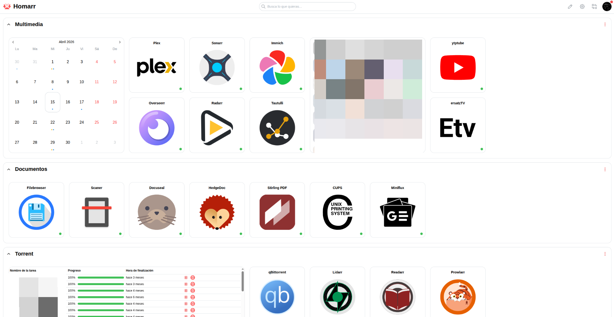

# 🏠 Home Server



These are some of the services I use in my Home Server. Everything is containerized to maintain maximum independence between services, facilitate updates, and ensure the portability of the entire system.

## 🛠️ Getting Started

### 📦 Prerequisites
- **OS**: Linux (Ubuntu 22.04+ recommended)
- **Engine**: [Docker](https://docs.docker.com/get-docker/) & [Compose V2](https://docs.docker.com/compose/install/)
- **Core**: Basic terminal proficiency and a text editor.

### ⚙️ Quick Setup
Most services utilize **Environment Variables** for secrets and dynamic configuration.

1. **Clone the repository**:
   ```bash
   git clone <your-repo-url>
   cd <repo-name>
   ```

2. **Configure the necessary variables**:
   Identify the service you want to deploy and edit its environment configuration:
   ```bash
   cd apps/<service-name>
   # Edit .env and fill in your unique values
   ```

3. **Deploy**:
   ```bash
   docker compose up -d
   ```

---

## 💎 Services Overview

### 🎬 Media & Entertainment
| Service | Access | Description |
| :--- | :--- | :--- |
| [**Plex**](https://github.com/plexinc) | `:32400` | The ultimate media streaming platform. |
| [**Immich**](https://github.com/immich-app/immich) | `:2283` | High-performance, AI-driven photo and video storage. |
| [**Arr Stack**](https://wiki.servarr.com/) | *Variable* | Automated media lifecycle (Radarr, Sonarr, Prowlarr, etc.) via VPN. |
| [**Audiobookshelf**](https://github.com/advplyr/audiobookshelf) | `:13378` | Self-hosted audiobook and podcast server. |
| [**ErsatzTV**](https://github.com/ErsatzTV/ErsatzTV) | `:8409` | Create your own virtual TV channels from local media. |
| [**Bazarr**](https://github.com/morpheus65535/bazarr) | `:6767` | Automatic subtitle downloader for Sonarr and Radarr. |
| [**Tautulli**](https://github.com/Tautulli/Tautulli) | `:8181` | Monitoring and analytics for your Plex Media Server. |
| [**Tdarr**](https://github.com/HaveAGitGat/Tdarr) | `:8265` | Distributed transcoding system for library optimization. |

### 🧠 Productivity & Documents
| Service | Access | Description |
| :--- | :--- | :--- |
| [**HedgeDoc**](https://github.com/hedgedoc/hedgedoc) | `:32769` | Real-time collaborative markdown note-taking. |
| [**Stirling-PDF**](https://github.com/Stirling-Tools/Stirling-PDF) | `:12532` | Swiss-army knife for PDF manipulation. |
| [**File Browser**](https://github.com/filebrowser/filebrowser) | `:13678` | Sleek web-based interface for your filesystem. |

### 🛡️ Infrastructure & Utility
| Service | Access | Description |
| :--- | :--- | :--- |
| [**Pi-hole**](https://github.com/pi-hole/pi-hole) | `:18080` | Network-wide ad-blocking and DNS management. |
| [**Homarr**](https://github.com/homarr-labs/homarr) | `:7575` | Stunning dashboard to unify your home server experience. |
| [**Cloudflared**](https://github.com/cloudflare/cloudflared) | *Tunnel* | Secure access to your services without opening ports. |
| [**Netdata**](https://github.com/netdata/netdata) | `:19999` | Real-time performance monitoring and analytics. |
| [**Watchtower**](https://github.com/containrrr/watchtower) | *Auto* | Automated updates for all your running containers. |
| [**Portainer**](https://github.com/portainer/portainer) | `:9443` | Powerful UI for managing Docker environments. |
| [**Zot**](https://github.com/project-zot/zot) | `:5000` | OCI-native container registry. |

### 🧩 Integration & Specialized Tools
| Service | Access | Description |
| :--- | :--- | :--- |
| [**Home Assistant**](https://github.com/home-assistant/core) | `:8123` | Open source home automation that puts local control first. |
| [**Overseerr**](https://github.com/sct/overseerr) | `:5055` | Request management and media discovery for Plex. |
| [**Miniflux**](https://github.com/miniflux/v2) | `:8080` | Minimalist and opinionated RSS feed reader. |
| [**CleanupArr**](https://github.com/cleanuparr/cleanuparr) | *CLI* | Manage and clean up unmonitored files in your Arr libraries. |
| [**CUPS**](https://github.com/ydkn/docker-cups) | `:631` | Common UNIX Printing System for network printing. |
| [**ytptube**](https://github.com/arabcoders/ytptube) | `:8081` | Web-based YouTube video downloader. |

---

## 🏗️ Infrastructure & Setup

To manage the underlying complexity of a growing home server, this setup relies on several key technologies:

- **Storage (MergerFS)**: Multiple physical drives are pooled into a single virtual mount point using **MergerFS**. This allows for easy media management across different disks without the overhead of traditional RAID, while remaining flexible to add or remove drives.
- **Remote Access (ZeroTier)**: A secure, peer-to-peer VPN provided by **ZeroTier** allows for seamless access to the entire local network from any device, anywhere in the world, as if they were on the same physical switch.
- **External Exposure (Cloudflare Tunnels)**: Specific services are exposed to the internet via **Cloudflare Tunnels**. This provides a secure way to share services publicly without opening ports on the router or managing local SSL certificates.

---

## 🔒 Security & Privacy First

> [!IMPORTANT]
> **Environment Protection**: The `.gitignore` is configured to exclude all `.env` files and persistent databases. **Never** commit sensitive credentials.

- **VPN Integration**: The Arr stack is routed through **Gluetun VPN** to ensure traffic remains private.
- **Sanitized Compositions**: All Compose files use `${VARIABLES}` to prevent hardcoded secrets.

## 🤝 Contribution & Maintenance
This is a personal template. Feel free to fork, adapt, and refine.

## 🌍 Discovery & External Resources

Self-hosting is a journey. Here are some invaluable resources for finding new services and alternatives:

- **[Hardware Power Consumption Guide](https://docs.google.com/spreadsheets/d/1LHvT2fRp7I6Hf18LcSzsNnjp10VI-odvwZpQZKv_NCI/edit?usp=sharing)**: A comprehensive spreadsheet showing idle and load power consumption for various CPUs and motherboards—excellent for deciding on home server hardware.
- **[Awesome Self-hosted](https://github.com/awesome-selfhosted/awesome-selfhosted)**: A massive, curated list of free software network services and web applications which can be hosted on your own servers.
- **[OpenAlternative](https://openalternative.co/self-hosted)**: A great place to find open-source and self-hosted alternatives to popular proprietary software.

---

## ⚖️ Disclaimer
This template is provided "as is". Self-hosting involves risks; ensure you follow security hardening guides for your host system.
